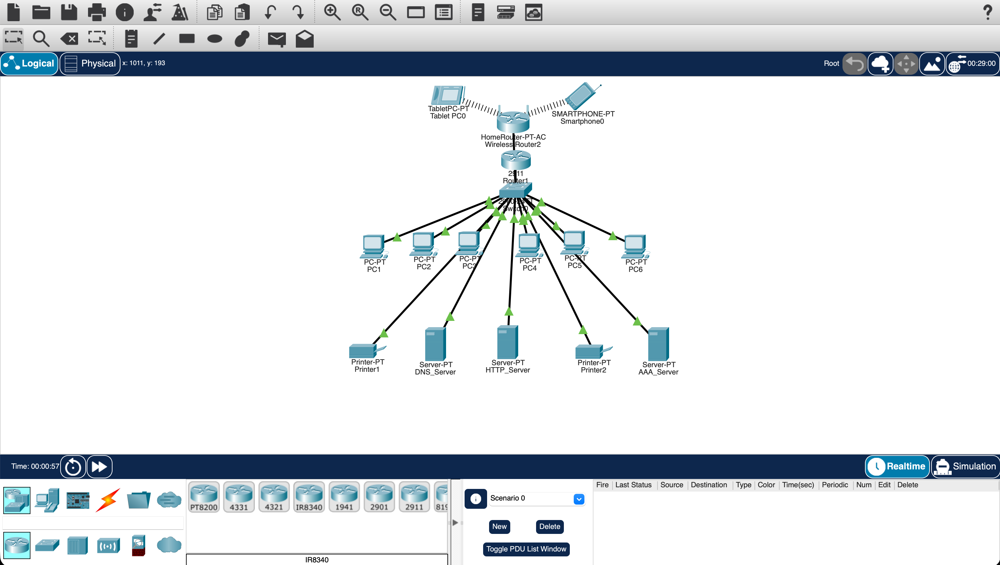

# Small Office Network Design & Implementation

**Cisco Packet Tracer · IPv4 & DHCP · WPA2-Enterprise · DNS & HTTP**

Designed and implemented a simulated small-office LAN connecting six PCs, two printers, a smartphone, and a tablet. The project combines wired and wireless access, reserved IP addressing, enterprise wireless authentication, and internal DNS and web services.

**By [Ronald Ssema](https://github.com/Ronald-ssema)** · Completed academic project

[Download the simulation](https://github.com/Ronald-ssema/network-design-and-simulation/raw/refs/heads/main/Network%20Design%20and%20Simulation%20using%20Cisco%20Packet%20Tracer.pkt) · [Configuration details](docs/network-design.md) · [Testing guide](docs/validation.md)

## Network at a glance

| Area | Implementation |
| --- | --- |
| Endpoints | Six PCs, two printers, one smartphone, and one tablet |
| Infrastructure | Central switch, Cisco 2911 router, and wireless router |
| Addressing | `192.168.1.0/24` with DHCP reservations and gateway `192.168.1.1` |
| Wireless access | WPA2-Enterprise with AES and RADIUS/AAA authentication |
| Network services | DNS at `192.168.1.2` and HTTP at `192.168.1.3` |
| Validation | Device connectivity, DNS resolution, and browser access from PC and mobile clients |

## What I built

- **A wired and wireless office LAN.** Connected workstations, shared printers, and servers through a central switch, with a wireless router serving mobile clients.
- **A structured IPv4 addressing plan.** Used DHCP reservations to assign consistent addresses to PCs, printers, and service hosts.
- **Enterprise wireless authentication.** Configured the `pollyvacher wireless` SSID with WPA2-Enterprise/AES and RADIUS/AAA.
- **Internal DNS and web services.** Mapped `www.pollyvacher.ac.uk` to the HTTP server using a DNS A record, allowing clients to access the lab website by name.

## Validation and outcome

Completed and passed the coursework, including device-to-device connectivity checks for at least two device pairs, DNS resolution, and HTTP access from both a PC and a mobile device.

The simulation file and original topology image are included. Test-output screenshots are still to be added to this portfolio. The [testing guide](docs/validation.md) explains how to repeat the checks.

## Skills demonstrated

| Skill | Application in this project |
| --- | --- |
| Network design | Combined wired endpoints, wireless clients, and shared services in one office topology |
| IPv4 addressing and DHCP | Planned a `/24` network with gateway settings and address reservations |
| Wireless security | Applied WPA2-Enterprise/AES with centralised authentication |
| DNS and HTTP configuration | Connected hostname resolution to an internal web service |
| Network validation | Checked connectivity and service access across PC and mobile endpoints |

## Open the lab

1. [Download the Packet Tracer file](https://github.com/Ronald-ssema/network-design-and-simulation/raw/refs/heads/main/Network%20Design%20and%20Simulation%20using%20Cisco%20Packet%20Tracer.pkt).
2. In **Cisco Packet Tracer**, select **File → Open** and choose the downloaded `.pkt` file.
3. Explore device settings, then follow the [testing guide](docs/validation.md).

The hostname `www.pollyvacher.ac.uk` is used inside the simulation. Open it from a simulated client's browser. Cisco Packet Tracer is required to run the lab; GitHub displays the documentation and topology image.

## Technical documentation

- [Network design and configuration](docs/network-design.md) — device inventory, IP addressing, wireless security, and services.
- [Testing and reproduction](docs/validation.md) — connectivity, DNS, and HTTP checks.
- [Original topology image](docs/images/network-topology.png) — full-size Packet Tracer screenshot.

## Next development steps

Publish the original test screenshots and a sanitised configuration record, then extend the lab with VLAN segmentation and access-control rules.
